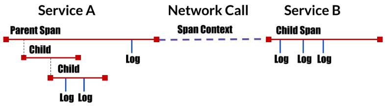

# 微服务追踪
微服务提供了一个强大的体系结构，但并非没有自己的挑战，特别是在调试和观察复杂网络中的分布式事务方面 - 仅仅因为没有内存调用或堆栈跟踪


## 分布式追踪数据模型


1. Trace: 事务在分布式系统中移动时的描述
2. Span：表示工作流程的一个命名的定时操作。 Spans接受k/v标签以及附加到特定跨度实例的细粒度，带时间戳的结构化日志。
3. Span context:
跟踪分布式事务所伴随的信息，包括通过网络或通过消息总线将服务传递给服务的时间。 span上下文包含跟踪标识符，span标识符以及跟踪系统需要传播到下游服务的任何其他数据。


### OpenTracing
OpenTracing API提供了标准，跨语言的框架, [详细教程](https://github.com/yurishkuro/opentracing-tutorial)

本文以python作为示例。


### Jaeger
它用于监视和排除基于微服务的分布式系统
- 分布式上下文传播
- 分布式事务监控
- 服务依赖性分析
- 根本原因分析
- 性能/延迟优化


[详细文档](https://www.jaegertracing.io/docs/1.11/)

#### 快速开始
**场景:**  ServiceA 的一个接口 test 会进行一次mysql查询， 投递消息到kafka, 访问一个第三方服务druid


步骤:
1. 启动Jaeger
```shell
docker run -d --name jaeger \
  -e COLLECTOR_ZIPKIN_HTTP_PORT=9411 \
  -p 5775:5775/udp \
  -p 6831:6831/udp \
  -p 6832:6832/udp \
  -p 5778:5778 \
  -p 16686:16686 \
  -p 14268:14268 \
  -p 9411:9411 \
  jaegertracing/all-in-one:1.11
```

2. 实现tracer
``` python
import logging
from jaeger_client import Config


def init_tracer(service):
    logging.getLogger('').handlers = []
    logging.basicConfig(format='%(message)s', level=logging.DEBUG)

    config = Config(
        config={  # usually read from some yaml config
            'sampler': {
                'type': 'const',
                'param': 1,
            },
            'logging': True,
            'reporter_batch_size': 1,
        },
        service_name=service,
    )

    # this call also sets opentracing.tracer
    return config.initialize_tracer()
```

3. 加上span的逻辑
``` python
import tornado.web

tracer = init_tracer("serviceA")

class Hello(tornado.web.RequestHandler):

    def get(self, *args, **kwargs):
        flag = self.request.uri + ":" + self.request.method

        with tracer.start_active_span(flag) as scope:
            self.connect_druid()
            self.connect_mysql()
            self.connect_kafka()

            self.write("Hello")

    def connect_mysql(self):
        with tracer.start_active_span('connect mysql') as scope:
            ....

    def connect_kafka(self):
        with tracer.start_active_span('produce to kafka') as scope:
            ....

    def connect_druid(self):
        with tracer.start_active_span('connect druid') as scope:
            ....

```

4. 访问serviceA这个接口, 从Jaeger UI追踪服务


##### 总结
1. 基于OpenTracing能够实现微服务全io的监控, 易于查找问题,
2. 对业务代码有侵入型， 业务端引入是否方便还得考量。
3. 加上opentracing会不会对原服务的性能造成影响。
